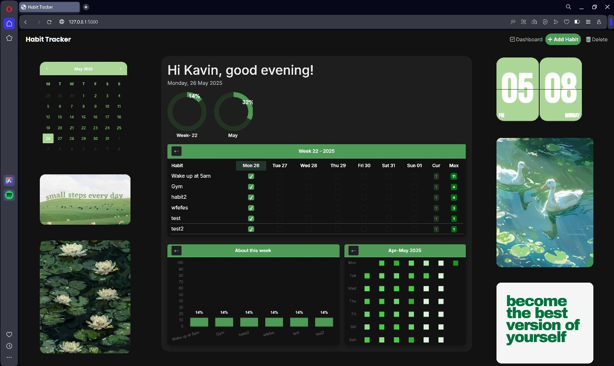
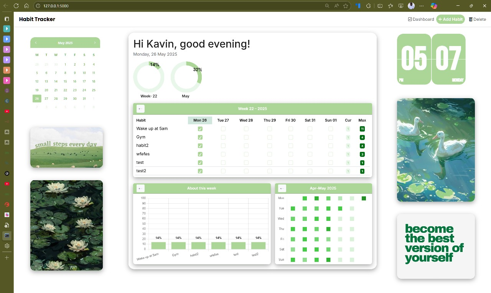

# 🧠 Habit Tracker App

A minimal, fast, and user-friendly habit tracking app – no installation or account needed.  
Just run `HabitTracker.exe` and stay on top of your goals.

---

# 📥 [⬇️ Download HabitTracker.exe](https://github.com/Kavin-Kumar-2003/Habit-Tracker/releases/download/v1.0/HabitTracker.exe)

---

## 🚀 Features

- ✅ Simple & clean web-based UI (opens in your default browser)
- 🌙 Light and Dark mode support
- 📝 Add, delete, and view daily habits
- 📁 Stores data locally in `data/habits.json`
- 📊 Responsive layout with smooth transitions

---

## 📸 Screenshots

### 🌙 Dark Mode  

### ☀️ Light Mode  

*(Images are just samples. Your interface will adapt to your system’s theme.)*

---

## 🛠 How to Use

1. **Download** the `HabitTracker.exe` file.
2. **Double-click** to run.  
   It will automatically open your browser with the app.

---

## 📁 Included Files

- `HabitTracker.exe` – Main executable
- `data/` – Your saved habits and name
- `templates/` – HTML templates
- `static/` – Images, CSS, and JavaScript

---

## 🧩 Tech Stack

- Python (Flask)
- HTML/CSS/JavaScript
- JSON for data storage

---

## 📎 Notes

- No internet connection required.
- All your data is saved locally in `data/`.
- If the app doesn't open automatically, just open your browser and go to:  
  [http://127.0.0.1:5000](http://127.0.0.1:5000)

---

## ❤️ Contributing

Want to add features like reminders, calendar view, or mobile support?  
Feel free to fork the repo or raise an issue.

---

## 📄 License

This project is licensed under the MIT License – see the [LICENSE](LICENSE) file for details.

